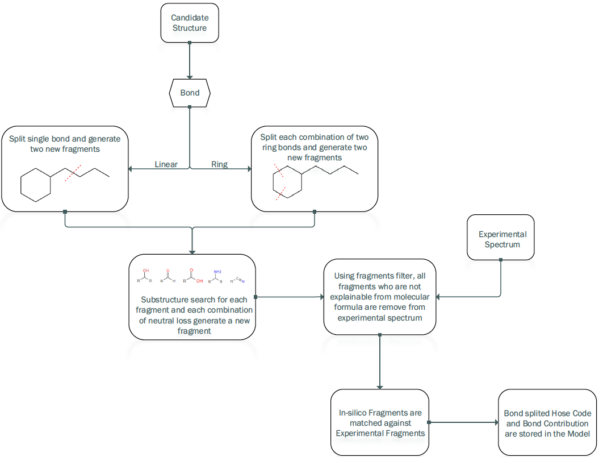

# mass-fragmentation

[![NPM version][npm-image]][npm-url]
[![build status][ci-image]][ci-url]
[![Test coverage][codecov-image]][codecov-url]
[![npm download][download-image]][download-url]

## Installation

`$ npm i mass-fragmentation`

## Usage

### <ins>candidatesFragmentation</ins>

This function performs the in-silico fragmentation (and accounts for neutral losses) of a given structure and returns the fragments which match the experimental spectrum and the bond contribution. The worflow of this function in shown in [Worflow](#workflow) section.

```js
import { candidatesFragmentation } from 'mass-fragmentation';

const spectrum = {
  x: [
    15.02348, 42.01056, 46.00548, 59.0133, 57.03404, 71.04968, 101.02386,
    117.05462,
  ],
  y: [50, 80, 40, 20, 60, 20, 30, 100],
};

const idCode = 'do}H@ClDeYeWXYZjjkj@@';

const options = {
  calculateHoseCodes: true,
  precision: 15,
  ionization: 'H+',
  limit: 1e7,
};

const result = await candidatesFragmentation(spectrum, idCode, options);
```

An example of the output of the function can be found on the following [snapshot](./src/candidatesFragmentation/__tests__/__snapshots__/candidatesFragmentation.test.js.snap)

### <ins>fragment</ins>

This function fragment both acyclic and cyclic bonds of a given molecule and returns it's fragments.

```js
import { fragment } from 'mass-fragmentation';

const idCode = 'do}H@ClDeYeWXYZjjkj@@';

const results = fragment(molecule, { calculateHoseCodes: true });
```

An example of the output of the function can be found on the following [snapshot](./src/fragmentation/__tests__/__snapshots__/fragment.test.js.snap)

## Workflow



## [API Documentation](https://cheminfo.github.io/mass-fragmentation/)

## License

[MIT](./LICENSE)

[npm-image]: https://img.shields.io/npm/v/mass-fragmentation.svg
[npm-url]: https://www.npmjs.com/package/mass-fragmentation
[ci-image]: https://github.com/cheminfo/mass-fragmentation/workflows/Node.js%20CI/badge.svg?branch=main
[ci-url]: https://github.com/cheminfo/mass-fragmentation/actions?query=workflow%3A%22Node.js+CI%22
[codecov-image]: https://img.shields.io/codecov/c/github/cheminfo/mass-fragmentation.svg
[codecov-url]: https://codecov.io/gh/cheminfo/mass-fragmentation
[download-image]: https://img.shields.io/npm/dm/mass-fragmentation.svg
[download-url]: https://www.npmjs.com/package/mass-fragmentation
